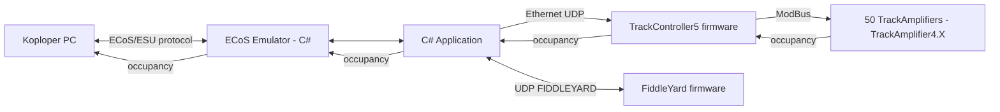
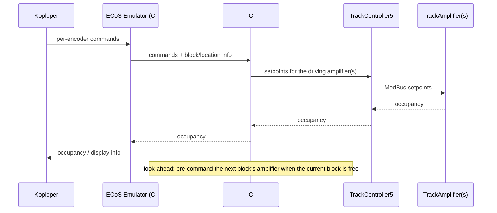

# Siebwalde Application Guide

This is the human-readable guide to the Siebwalde application. It explains what the system does, how the C# application is structured, how the main workflows run, and what is verified versus planned.

Evidence rule: behavior described here is code-inspected unless a section says "runtime-verified". Software-only runtime verification has been performed through the ECoS simulator on port 15471 (loco commands, switch mapping, divergence detection, safety interlock and reset); no physical hardware test has been performed. Items that are planned but not implemented are marked **Planned**.

See also: `docs/product.md` (requirements and priorities), `docs/architecture.md` (architecture detail), `docs/implementation.md` (implementation detail), `docs/inventory.md` (inventory), `docs/build-test.md` (build results).

---

## 1. What Siebwalde Is

Siebwalde is a model railway control project for the Siebwalde yard. It combines:

- A Windows C# application that the operator uses and that talks to the layout.
- Microcontroller firmware on the layout (track controller, amplifiers, backplanes, Fiddle Yard, servo, Faller Car, yard controller).
- Koploper as the driving-behavior authority, connected through an ECoS/ESU emulator.

The long-term control idea is that Koploper decides how trains move, and the C# application translates Koploper commands into hardware commands for the amplifiers, then feeds occupancy back to Koploper.

---

## 2. System Overview



Current reality: the emulator exists and the C# application can initialize and drive the track amplifiers and the Fiddle Yard, but the full Koploper-to-amplifier translation loop is **Planned**.

---

## 3. The C# Application

### 3.1 Projects and solutions

| Project | Solution | Target | Role |
| --- | --- | --- | --- |
| `SiebwaldeApp` | `SiebwaldeApp/SiebwaldeApp.sln` | `net8.0-windows` | WPF desktop UI (with Windows Forms integration). |
| `SiebwaldeApp.Core` | `SiebwaldeApp/SiebwaldeApp.sln` | `net8.0` | Domain logic: track application, Fiddle Yard, simulator, logging, services. |
| `SiebwaldeApp.EcosEmu` | `SiebwaldeApp/SiebwaldeApp.sln` | `net8.0-windows7.0` | ECoS/ESU emulator library. |
| `SiebwaldeApp.Core.Host` | `SiebwaldeApp.Core.Host/SiebwaldeApp.Core.Host.sln` | `net8.0-windows7.0` | Console host for track initialization. |
| `SiebwaldeApp.EcosEmu.Host` | `SiebwaldeApp.EcosEmu/SiebwaldeApp.EcosEmu.sln` | `net8.0-windows7.0` | Console host for the emulator. |

### 3.2 Entry points

| Entry point | File | What it does |
| --- | --- | --- |
| `App.OnStartup` | `SiebwaldeApp/SiebwaldeApp/App.xaml.cs` | Creates the log directory, binds logging and file services, calls `IoC.Setup`, then shows `MainWindow`. |
| `Program.Main` | `SiebwaldeApp.Core.Host/Program.cs` | Console host: configures Core logging, builds a UDP transport, runs the initialization pipeline. |
| `Program.Main` | `SiebwaldeApp.EcosEmu/SiebwaldeApp.EcosEmu.Host/Program.cs` | Starts Koploper external info, the simulator backend, the ECoS backend, and the TCP server. |

### 3.3 Dependency injection (IoC)

There are two separate IoC facades:

- UI: `SiebwaldeApp/IoC/IoC.cs` uses Ninject (`IoC.Kernel`, an `IKernel`). `IoC.Setup()` binds `ApplicationViewModel`, `SideMenuViewModel`, and `SiebwaldeApplicationModel`.
- Core: `SiebwaldeApp.Core/IoC/IoC.cs` is a small static service locator with only `Logger` and `ConfigureLogger`. Core classes log through `IoC.Logger`.

This split is intentional but is a known cleanup area. `SiebwaldeApp.Core.Host` was fixed to use `IoC.ConfigureLogger` (Increment 1).

### 3.4 Startup sequence

1. `App.OnStartup` runs `ApplicationSetup`.
2. `ApplicationSetup` ensures the log directory exists and binds `ILogFactory` and `IFileManager`.
3. `IoC.Setup()` binds the view models and `SiebwaldeApplicationModel`.
4. `MainWindow` is created and shown.
5. Navigation uses `ApplicationViewModel`, `SideMenuViewModel`, and page converters.

Operator actions on `SiebwaldeInitPage`:

- `DetectHosts` runs `HostDetection` for FiddleYard (ping on `FIDDLEYARD`), the TrackController (ping on its configured IP) and Koploper (TCP connect to `127.0.0.1:5700`), and shows the result with a step/state log.
- `InitTrackController` -> `SiebwaldeApplicationModel.StartTrackApplication()` (enabled when the TrackController is detected).
- `InitFiddleYardController` -> `SiebwaldeApplicationModel.StartFYController(false)` (enabled when the Fiddle Yard is detected).
- `InitFiddleYardSimulator` -> `SiebwaldeApplicationModel.StartFYController(true)`; this forces the Fiddle Yard simulator and is operator-activated.
- There is no simulator option for Koploper or the TrackController.

Note: detection and page behavior are code-inspected, not runtime-verified. An initial detection pass runs when the page is constructed.

---

## 4. Track Control

### 4.1 Communication

The C# application talks to TrackController5 over UDP:

- Remote target: `192.168.1.193:10000`.
- Local receive port: `10001`.
- Frame header `0xAA`; slave info marker `0xFF`.

`TrackCommClientAsync` builds `[HEADER, Command, Data...]` frames, sends them through `ITrackTransport`, and parses incoming amplifier frames and controller messages.

### 4.2 Initialization pipeline

`StartTrackApplication` builds the transport, the communication client, the bootloader helpers, the initialization steps, and `TrackAmplifierInitializationServiceAsync`. The steps run in order:

1. `ConnectToEthernetTarget`
2. `ResetAllSlaves`
3. `DataUpload`
4. `DetectSlaves`
5. `RecoverSlaves`
6. `FlashFwTrackamplifiers`
7. `InitTrackamplifiers`
8. `SetDefaultPwmSetpoints`
9. `EnableTrackamplifiers`

Each step returns a next-step name; the service moves by name and finishes when a step returns Completed. Step 8 sets a default PWM setpoint (400) for all amplifiers before they are enabled.

When initialization reaches Completed, `TrackControlMain.StartRuntime` starts the runtime write loop.

### 4.3 Runtime writes

UI methods (`SetAmplifierPwm`, `SetAmplifierEmStop`, `SetAmplifierControl`) update desired amplifier control in `TrackApplicationVariables`. `TrackControlMain` consumes `PendingWrites` at about 10 Hz and sends `TrackCommand.EXEC_MBUS_SLAVE_DATA_EXCH`.

### 4.4 Firmware transfer

`TrackAmplifierBootloaderHelpers` reads the firmware hex file and computes checksums. `SendNextFwDataPacket` sends firmware data chunks. The firmware path is currently hard-coded (see section 8).

---

## 5. Fiddle Yard

`StartFYController` builds a MAC/IP payload and constructs `FiddleYardController` using the Fiddle Yard ports from `CoreSettings` (`FYSendingport` 28671, `FYReceivingport` 28672).

`FiddleYardController` pings the target name `FIDDLEYARD`. If the target is found it sets up UDP and starts the receiver; otherwise it uses the simulator. It owns `FYIOHandleTOP` and `FYIOHandleBOT`. `FiddleYardApplication` owns the higher-level state machine (Idle, Start, Init, Running, Stop, Reset, MIP50Home, MIP50Move, TrainDetection).

The Fiddle Yard is deliberately out of scope for the current cleanup and must keep working unchanged.

---

## 6. ECoS Emulator and Koploper

The emulator presents a layout to Koploper as if it were an ECoS/ESU command station.

- `EcosEmulatorServer` listens on loopback TCP `15471`, accepts clients, accumulates commands until `)`, parses with `SimpleEcosCommandParser`, and dispatches to `SimpleEcosBackend`.
- `SimpleEcosBackend` handles `set`, `get`, `queryObjects`, `request`, `release`, `create`, and `delete`, and emits ECoS-style `<REPLY>`/`<END>` blocks.
- `KoploperExternalInfoClient` connects to `127.0.0.1:5700`, parses `0x1B`-separated records, and reports block/locomotive state.
- `TrackSimulatorBackend` simulates blocks, switches, and occupancy.
- `JsonLocoRepository` persists locomotive data at `Logging/locos.json`.

Koploper initiates the connection with its own "make connection" button. The exact protocol and the two port roles are derived from `Ecos ESU info` and the code (see `docs/backlog.md`).

---

## 7. Target Control Loop (Planned)



Key planned behaviors:

- Setpoint control follows the locomotive.
- Block-to-amplifier topology is user-configurable in `app.config`.
- When a block is free, the next block's amplifier is pre-commanded (look-ahead).
- Amplifier errors (over-temperature/over-current) must be reported toward Koploper; the exact ECoS overload semantics still require research.

---

## 8. Configuration and Endpoints

Core configuration values are read through `SiebwaldeApp.Core.CoreConfiguration`, which exposes them from `app.config` (`SiebwaldeApp.Core.Properties.CoreSettings`). Startup code no longer hard-codes the track controller address or the firmware path.

| Setting | Default | Used by |
| --- | --- | --- |
| `LogDirectory` | `C:\Localdata\Siebwalde\Logging\` | Logging. |
| `FYSendingport` | `28671` | Fiddle Yard. |
| `FYReceivingport` | `28672` | Fiddle Yard. |
| `TrckSendingPort` | `10000` | Track controller UDP target port. |
| `TrckReceivingPort` | `10001` | Track controller local receive port. |
| `TrckIpAddress` | `192.168.1.193` | Track controller IP address. |
| `TrackAmplifierFwPath` | `...\TrackAmplifier4.X.production.hex` | Firmware transfer. |

`CoreConfiguration` properties: `TrackControllerIpAddress`, `TrackControllerSendingPort`, `TrackControllerReceivingPort`, `TrackAmplifierFirmwarePath`, `LogDirectory`, `FiddleYardSendingPort`, `FiddleYardReceivingPort`.

Note: the WPF application currently relies on the settings' Designer defaults; the `SiebwaldeApp.Core.Properties.CoreSettings` section is not yet present in the WPF `App.config`.

**Planned:** all values become editable and persisted via a menu -> settings screen, with a default per entity and undo (Ctrl-Z).

| Endpoint | Value |
| --- | --- |
| Track controller | `192.168.1.193:10000` (local `10001`) |
| Fiddle Yard target name | `FIDDLEYARD` (ports `28671`/`28672`) |
| ECoS emulator | `127.0.0.1:15471` |
| Koploper external info | `127.0.0.1:5700` |
| Log directory | `C:\Localdata\Siebwalde\Logging\` |
| Locomotive store | `C:\Localdata\Siebwalde\Logging\locos.json` |

---

## 9. Building and Running

Build commands (Debug, from `C:\Localdata\Siebwalde`):

```powershell
dotnet build "SiebwaldeApp\SiebwaldeApp.sln" -c Debug
dotnet build "SiebwaldeApp.Core.Host\SiebwaldeApp.Core.Host.sln" -c Debug
dotnet build "SiebwaldeApp.EcosEmu\SiebwaldeApp.EcosEmu.sln" -c Debug
```

Verified on 2026-09-11: all of the above build with 0 errors. `SiebwaldeApp.Core.Host` builds with `--real`/fake transport selection at startup.

Requirements: Windows, a .NET SDK capable of building .NET 8 projects, and the network targets above when running against real hardware. Do not connect to hardware without explicit authorization.

The console hosts can run offline: `SiebwaldeApp.Core.Host` supports a fake in-process transport, and the Fiddle Yard and ECoS simulator provide simulated data.

---

## 10. Current Status and Known Gaps

Completed cleanup (2026-09-11, branch `feature/csharp-cleanup-startup`):

- Increment 1: fixed `SiebwaldeApp.Core.Host` logging and the initialization step sequencing.
- Increment 2: removed the obsolete `SiebwaldeApp.Tests` station-domain test project.
- Increment 3: removed Pic18/station UI remnants and the Page-Removed legacy XAML leftovers.

Known gaps (tracked in `docs/backlog.md`):

- Configuration authority: hard-coded endpoints/paths are not yet centralized (**Planned**).
- Host detection on `SiebwaldeInitPage` (ping on host name; TCP connect for Koploper) (**Planned**).
- Settings screen with default/undo (**Planned**).
- Koploper translation path and look-ahead (**Planned**).
- New unit tests for the window/program model (there is currently no active test project).
- Not runtime-verified: Fiddle Yard error paths, `SendNextFwDataPacket` await behavior, `TrackCommClientAsync` publish-interval comment, ECoS multi-client behavior.

---

## 11. Glossary

| Term | Meaning |
| --- | --- |
| MMDC | "Material Machine Damage Control": protection and fault handling (over-current, over-temperature, communication loss). |
| Koploper | PC model-railway control software that owns driving behavior here. |
| ECoS/ESU | The command-station protocol Koploper speaks; emulated by `SiebwaldeApp.EcosEmu`. |
| Fiddle Yard | The staging yard; its controller is firmware, driven from C# over UDP. |
| Amplifier | TrackAmplifier4.X unit driving a track section (PWM + occupancy + MMDC). |
| TrackController5 | Firmware ModBus/bootloader master between C# and the amplifiers. |
| Pendelbaan | Shuttle line: 1-4 locomotives between 3 stations, using 2 ModBus amplifiers. |
